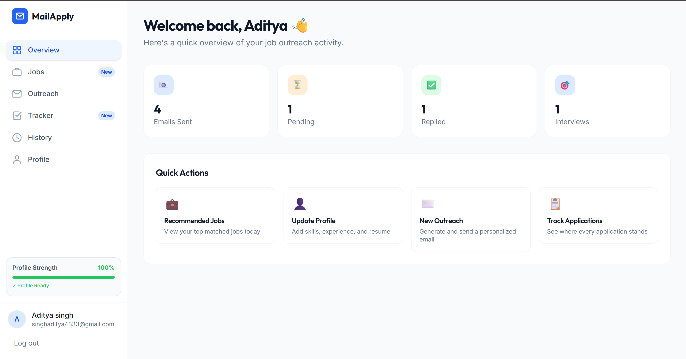
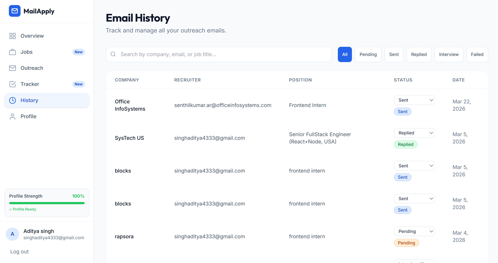
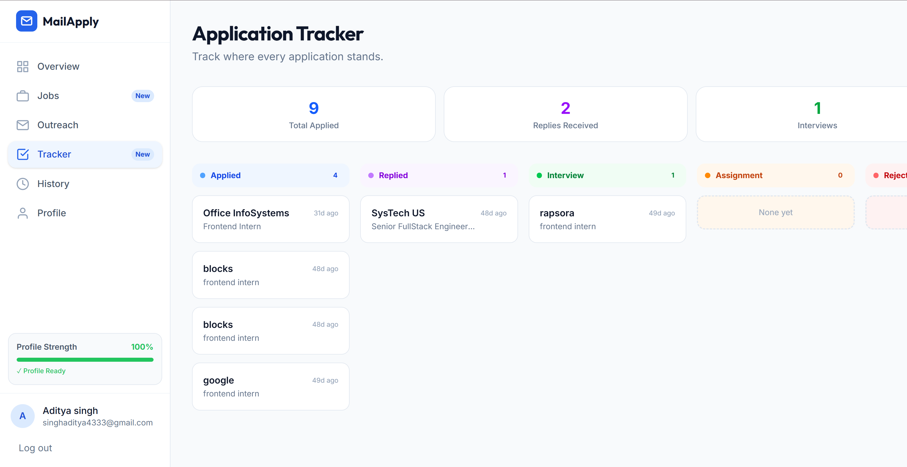
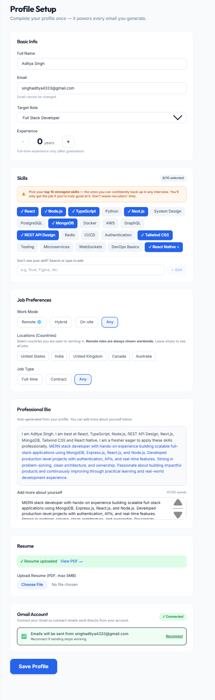
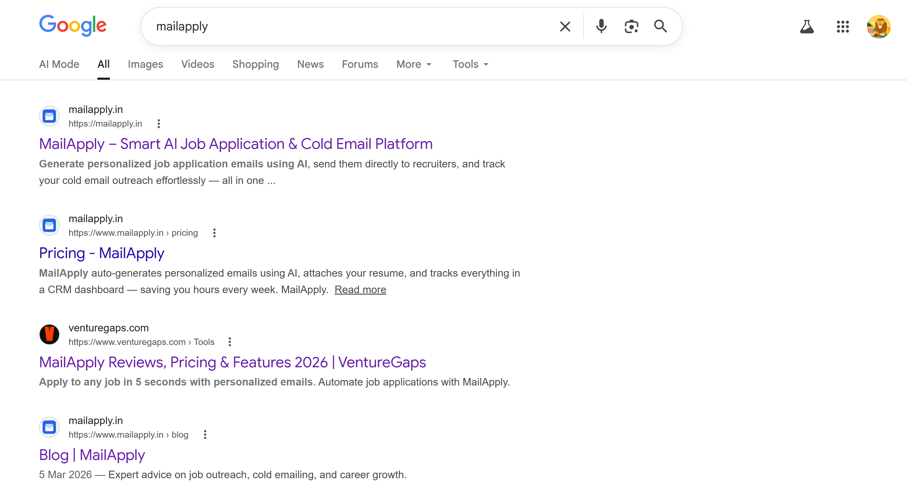
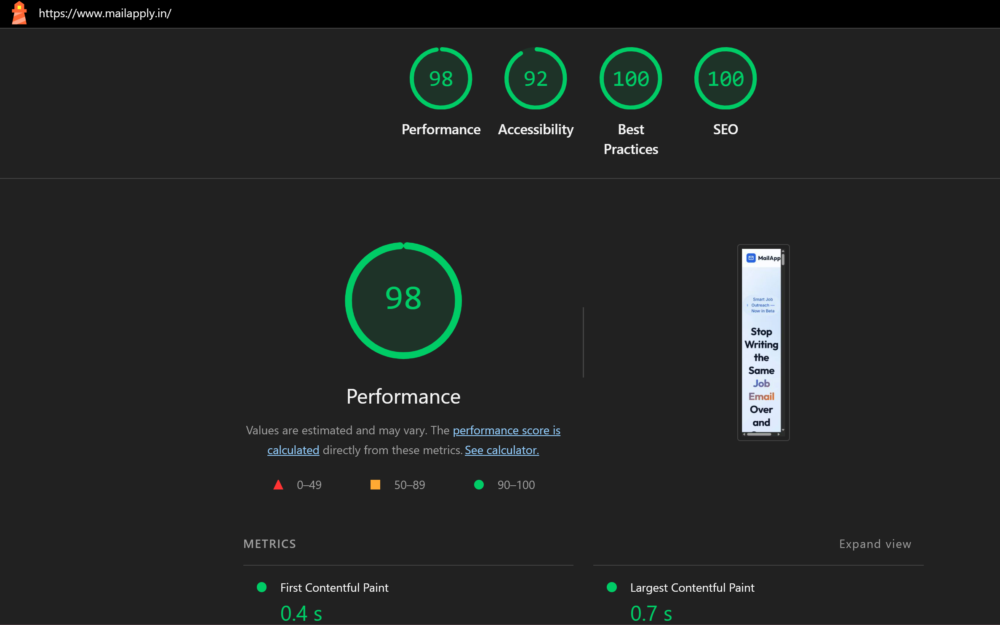
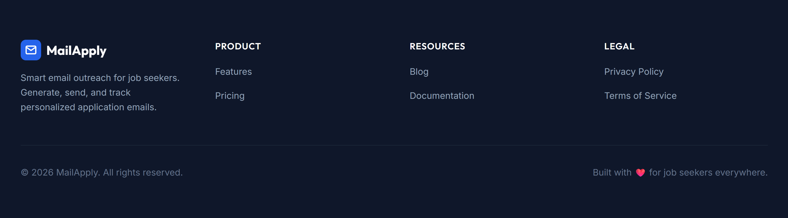

<div align="center">
  
  <h1 align="center">MailApply — Intelligent Job Application Tracker</h1>

  <p align="center">
    <strong><em>Streamline your job hunt. Track applications, manage emails, and land your next role.</em></strong>
    <br />
    <a href="https://github.com/Adityas3111N/mailapply"><strong>Explore Repository »</strong></a>
    ·
    <a href="https://github.com/Adityas3111N/mailapply/issues">Report Bug</a>
  </p>
</div>

<!-- Tech Stack Badges -->
<div align="center">
  
  
  
  
  
</div>

<br />

<div align="center">
  
</div>

## 📖 Overview

**MailApply** is a comprehensive SaaS platform built to solve the chaos of modern job hunting. Instead of losing track of endless emails and application portals, MailApply centralizes your job search. 

Built on a modern **Next.js 14** stack, the application features seamless **Google OAuth** integration, allowing users to safely connect their accounts, track their application history, and monitor email communications from a single, unified dashboard.

---

## ✨ Core Features & Platform Showcase

### 📊 The Command Dashboard
A centralized hub giving users an immediate overview of their application pipeline, recent activity, and success metrics.

<div align="center">
  
</div>

### 🔐 Secure Google Integration
Frictionless onboarding and secure communication tracking powered by Google OAuth. We prioritize data privacy and seamless user experience.

<div align="center">
  
</div>

### 🗂️ Application & Email History
Never lose track of a job lead again. Dedicated interfaces for tracking individual job applications and the corresponding email threads sent to recruiters.

<div align="center">
  
  &nbsp;
  
</div>

### 👤 Profile & Resource Management
Users can manage their professional profiles, resumes, and personal details effortlessly. The platform also includes a fully integrated blog section to provide users with career advice and platform updates.

<div align="center">
  
  &nbsp;
  
</div>

---

## ⚡ Technical Excellence

MailApply isn't just about features; it's engineered to the highest web standards.

### SEO & Discoverability
Proper semantic HTML, dynamic meta tags, and structured data ensure MailApply ranks beautifully on search engines.

<div align="center">
  
</div>

### Uncompromising Performance
We target exceptional Lighthouse scores. By leveraging Next.js React Server Components (RSC) and aggressive caching, the application feels instant.

<div align="center">
  
</div>

---

## 🏗️ Technical Architecture

| Category | Technology | Description |
| :--- | :--- | :--- |
| **Frontend** | Next.js 14 (App Router) | Server-side rendering, API routes, and Server Actions. |
| **Styling** | Tailwind CSS | Utility-first responsive design. |
| **Database** | SQL / ORM | Robust relational data modeling for users and applications. |
| **Authentication**| NextAuth & Google OAuth | Secure token management and provider integration. |
| **Deployment** | Vercel | Edge network delivery and CI/CD pipelines. |

---

## ⚙️ Running Locally

### 1. Clone & Install
```bash
git clone https://github.com/Adityas3111N/mailapply.git
cd mailapply
npm install
```

### 2. Environment Setup
Create a `.env.local` file at the root. Use `.env.example` as a reference.
You will need Google OAuth Credentials (Client ID & Secret) and your Database URI.
```bash
cp .env.example .env.local
```

### 3. Start Development Server
```bash
npm run dev
```
Open [http://localhost:3000](http://localhost:3000) with your browser to see the local application.

---

## 👨‍💻 Author

**Aditya Singh**
- LinkedIn: [Aditya Singh](https://www.linkedin.com/in/aditya-singh-0a7181349/)
- GitHub: [@Adityas3111N](https://github.com/Adityas3111N)
- Email: [singhaditya4333@gmail.com](mailto:singhaditya4333@gmail.com)

<div align="center">
  <br/>
  
  <br/><br/>
  <i>"Streamlining the journey from application to offer."</i>
</div>
